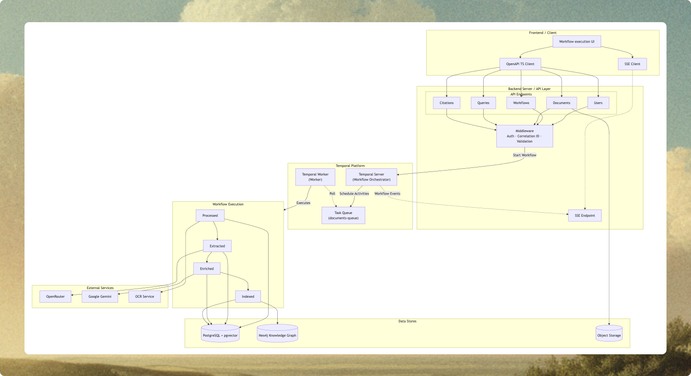

# [Insura AI](https://github.com/Shreekar11/insura-ai)


> Durable AI-powered insurance document analysis workspace with GraphRAG retrieval.

## Solution

Insura AI helps automate end-to-end insurance workflows such as Policy Comparison, Quote Comparison, and Proposal Generation. Upload insurance documents, get structured extraction data with full source traceability (citations), and interact with an AI assistant powered by a knowledge base specific to your workflow. Designed with a robust, staged durable pipeline orchestrated by Temporal, it ensures reliable execution and resumability on failure.

## Features

- **Staged Durable Pipeline**: Sequential processing from OCR → Classification → Extraction → Enrichment → Indexing.
- **Durable Orchestration**: Powered by Temporal, ensuring workflows are resumable and survive transient failures.
- **Tiered Citation Resolution**: Multi-tier strategy (Direct Match → Semantic Search → Placeholder) tracing extracted facts back to PDF source.
- **Hybrid GraphRAG Retrieval**: Combines Vector embeddings (pgvector) and Knowledge Graphs (Neo4j) for high-accuracy semantic and relational queries.
- **Secure Document Storage**: Supabase Storage with Row-Level Security (RLS) and signed URLs.
- **Real-Time Streaming**: Live workflow progress updates delivered via Server-Sent Events (SSE).
- **Type Safety & Consistency**: OpenAPI-first bidirectional schemas generating Pydantic models and TypeScript clients.

## System Architecture

### High-Level System Architecture



## Tech Stack

### Backend

| Layer                 | Technology            | Purpose                                  |
| --------------------- | --------------------- | ---------------------------------------- |
| **Web Framework**     | FastAPI               | API endpoints, SSE streaming             |
| **Orchestration**     | Temporal              | Durable, resumable workflow management   |
| **Database**          | PostgreSQL + pgvector | Relational data + Vector embeddings      |
| **Knowledge Graph**   | Neo4j                 | Entity relationships and GraphRAG        |
| **LLM Orchestration** | OpenRouter / Gemini   | Extraction, summarization, and retrieval |
| **OCR**               | Docling               | Layout-aware document processing         |
| **Validation**        | Pydantic 2.5          | Type-safe data validation                |

### Frontend

| Technology           | Purpose                 |                                           |
| -------------------- | ----------------------- | ----------------------------------------- |
| **Framework**        | Next.js 16 (App Router) | Modern React framework                    |
| **State Management** | React Query             | Data fetching and caching                 |
| **UI Components**    | Shadcn UI + TailwindCSS | Responsive and accessible design          |
| **Document Viewer**  | React PDF Viewer        | Interactive PDF rendering with highlights |
| **API Client**       | Generated TS Client     | Type-safe communication with backend      |

## Challenges & Solutions

| Challenge                 | Problem                                        | Solution                                         | Impact                         |
| ------------------------- | ---------------------------------------------- | ------------------------------------------------ | ------------------------------ |
| **LLM Truncation**        | Long policies exceed context windows           | Hybrid chunking + batch processing               | All document types processable |
| **Resource Constraints**  | Parallel stages exhaust CPU on low-tier infra  | Sequential stage processing                      | Stable worker availability     |
| **Citation Paraphrasing** | LLM rephrasing breaks direct text matches      | Tiered resolution: text → semantic → placeholder | ~95% citation coverage         |
| **Relationship Loss**     | Entities in different batches cannot be linked | Strategic overlap + synthesis pass               | Improved graph completeness    |

## Best Practices & Conventions

| Practice                 | What                                   | Why                                     |
| ------------------------ | -------------------------------------- | --------------------------------------- |
| **OpenAPI Schemas**      | Single spec → backend + frontend types | Prevents schema drift and UI bugs       |
| **Layered Architecture** | API → Service → Repository             | Separation of concerns and testability  |
| **Temporal Durability**  | Timeouts + retries + idempotency       | Survives transient network/API failures |
| **LLM Batching**         | Chunk batching + provider fallback     | Reliability under strict rate limits    |
| **Secure Storage**       | JWT + RLS + signed URLs                | Strict tenant isolation and compliance  |
| **Typesafe Boundaries**  | Pydantic + Generated TS                | Validated I/O at every layer            |

## Deployment

- **Vercel** - Deployment platform for frontend
- **Render** - Deployment platform for primary backend
- **AWS EC2** - Deployment platform for self-hosted Temporal cluster (Docker) and Temporal Worker
- **Supabase** - Managed platform for PostgreSQL + pgvector and Object Storage
- **Neo4j AuraDB** - Managed platform for Neo4j Knowledge Graph

## Deployment Links

- **Frontend**: [Frontend Website](https://insura-ai-sepia.vercel.app)
- **Backend**: [Backend Server](https://insura-ai-backend.onrender.com)
- **Temporal Worker**: Temporal Worker - http://[EC2_IP_ADDRESS]:8001
- **Temporal Server**: Temporal Server - http://[EC2_IP_ADDRESS]:7233
- **Temporal Web UI**: Temporal Web UI - http://[EC2_IP_ADDRESS]:8080

## Future Improvements

- **Salesforce CRM Integration**: Bidirectional sync between Insura AI and Salesforce records.
- **AI Agentic Functionality**: Introduce tool-calling loops using Temporal for autonomous multi-step actions.
- **Expanded Workflows**: Property Submission, SOV Intake, and Claims Intake processing.
- **LLM Response Caching**: Semantic caching via Redis/LangCache to reduce costs and latency.
- **Vercel AI SDK Adoption**: Native streaming support for real-time AI assistant responses.

## Getting Started

### Prerequisites

- Docker & Docker Compose
- Node.js & pnpm
- Python 3.11+

### Installation

1. Clone the repository:

   ```bash
   git clone https://github.com/Shreekar11/insura-ai.git
   cd insura-ai
   ```

2. Set up environment variables:
   Create a `.env` file in each of the `backend` and `frontend` directories based on the `.env.example` files.

### Run via Docker

The easiest way to get started is using Docker Compose, which spins up the entire stack (Frontend, Backend, Temporal, Worker, Postgres and Neo4j).

```bash
docker-compose up --build
```

### Local Development

1. **Backend**:

   ```bash
   cd apps/backend
   pnpm dev
   ```

2. **Temporal Worker**:
   ```bash
   cd apps/backend
   uv run app/temporal/worker.py
   ```

3. **Frontend**:

   ```bash
   cd apps/frontend
   pnpm install
   pnpm dev
   ```

## Contact

For any inquiries or support, please email us at shreekargade2004@gmail.com or open an issue in this repository.

Enjoy your insurance workflow automation process!⚒️🚀
